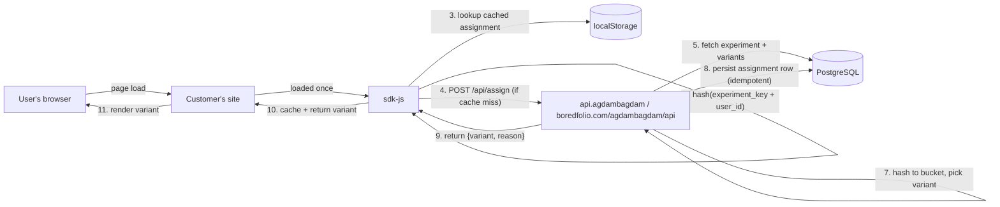
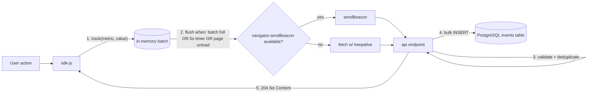
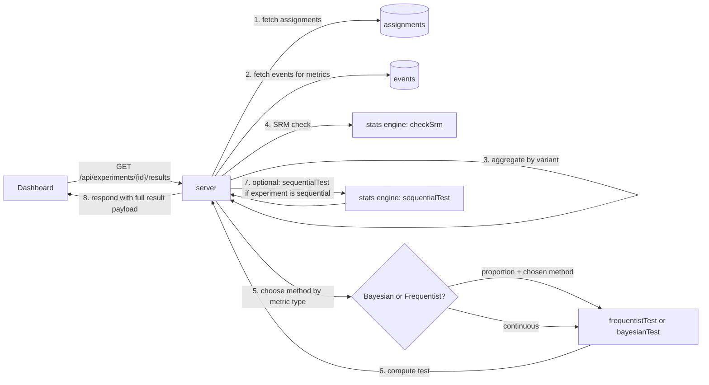
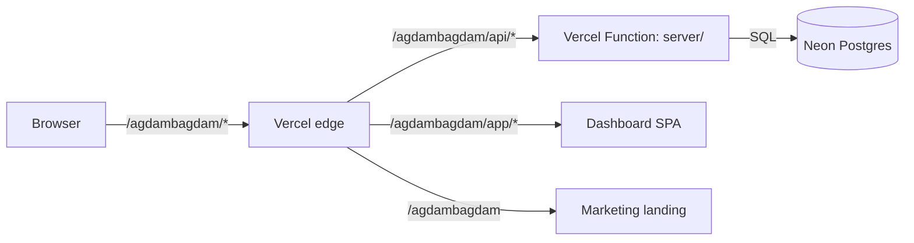
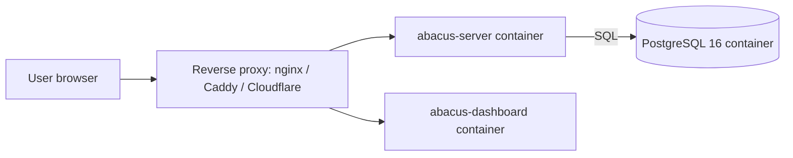

# Architecture

This document describes how Agdam Bagdam is organized, how requests flow through the system, and why the boundaries are where they are. If you're evaluating the platform for an enterprise deployment, read this first.

---

## Guiding principles

1. **Correctness before features.** The statistics engine has zero runtime dependencies and is the only package that treats numerical bugs as security-equivalent.
2. **Deterministic by default.** Same user + same experiment key = same variant, everywhere, forever (unless explicitly reassigned). This is what makes A/B tests trustworthy.
3. **Privacy-first.** No third-party cookies. No egress in self-hosted mode. First-party data only.
4. **Self-host parity.** Every capability in the hosted demo is also available in the Docker Compose stack. No "cloud-only" features that trap users.
5. **Small, well-tested surface.** If a capability cannot be covered by tests + Monte Carlo + reference parity, we don't ship it.

---

## Monorepo layout

```
abacus/
├── packages/
│   ├── stats/          Zero-dependency TypeScript statistics engine (~3k LOC)
│   ├── server/         Express 5 + PostgreSQL API server
│   ├── sdk-js/         Browser SDK (< 15 KB gzipped)
│   ├── sdk-node/       Node.js server-side SDK
│   └── dashboard/      React 19 + Vite 6 + Tailwind dashboard
├── api/                Vercel serverless entry points wrapping packages/server
├── docker/             Docker Compose reference stack (Postgres + server + dashboard)
├── packages/stats/benchmarks/
│                       Monte Carlo validation, SciPy/R reference parity
├── .github/workflows/  CI: tests, typecheck, lint, audit, semgrep, gitleaks,
│                       bundle-size budget, license-check, stats-validation
├── BENCHMARKS.md       Statistical validation methodology and latest results
├── FEATURES.md         Honest competitor matrix
├── SECURITY.md         Disclosure policy, scope, response SLAs
└── SHIP_CHECKLIST.md   Pre-launch readiness checklist
```

### Why a monorepo?

- **Wire-contract coupling.** The SDK and the server speak a specific JSON contract for assignment and event tracking. Silent drift between them is a P0. Co-locating them makes the contract auditable in a single PR.
- **Shared statistics.** The stats engine runs on both the server (results API) and will run in the SDK (for offline evaluation). Single source of truth.
- **Single CI run** for integration-level confidence.

---

## Package boundaries

| Package | Depends on | Depended on by | Runtime deps |
|---|---|---|---|
| `stats` | nothing | `server`, `sdk-js`, `sdk-node` (future) | **zero** |
| `server` | `stats`, `pg`, `express` | `dashboard`, `api` (Vercel wrappers) | PostgreSQL |
| `sdk-js` | nothing (bundles its own hash function) | customer sites | fetch/sendBeacon |
| `sdk-node` | nothing | customer server code | fetch |
| `dashboard` | server via HTTP only | customers (browser) | server API |

**Invariant:** `packages/stats/` must never gain a runtime dependency. CI blocks PRs that add one.

---

## Request flow — variant assignment

Assignment is the hot path. It must be deterministic, fast, and correct under network partitions.



### Properties we guarantee
- **Deterministic:** `MurmurHash3(experiment_key + user_id)` produces the same 32-bit integer on the server and in any SDK, forever. Same input → same variant.
- **Idempotent:** Writing the assignment twice is safe. `INSERT ... ON CONFLICT DO NOTHING` on `(experiment_id, user_id)` primary key.
- **Offline-capable:** The SDK caches assignments in `localStorage`. Network failures don't break experiments.
- **Targeting-aware:** Rules like country=IN, plan=pro are evaluated server-side before bucketing.

### Properties we don't claim
- Zero-latency. The first assignment for a user round-trips to the server.
- Atomic multi-experiment assignment. Each experiment is assigned independently.

---

## Request flow — event tracking

Events are the cold path. Volume can spike; we optimize for throughput over latency.



### Properties we guarantee
- **At-least-once delivery.** Events may be retried on network failures; deduplication is done server-side on `event_id`.
- **Non-blocking.** Tracking never blocks the user's page (no synchronous XHR).
- **Survives navigation.** `sendBeacon` is preferred for page-unload events.

---

## Results computation flow

Results are computed on demand, not precomputed. This keeps the data model simple and lets us change statistical methods without backfilling.



### Why on-demand?

- Statistical methods evolve. If we change how Bayesian priors work, users see the update on next refresh. No backfill.
- Results are small enough to compute in < 100 ms for typical experiment sizes. Scaling bottleneck is aggregation, not stats.
- Caching is possible via HTTP `Cache-Control` for fixed-completed experiments, but not yet implemented.

### Why both Bayesian and Frequentist?

Different stakeholders speak different languages. Product managers and executives often think in "probability it's better." Data scientists and academic reviewers want p-values. We serve both, in the same result payload, so neither side has to translate.

---

## Deployment topology

Two reference deployments are supported.

### 1. Hosted demo (boredfolio.com/agdambagdam)



- Marketing, docs, app, and API all live under `boredfolio.com/agdambagdam/*` via Vercel path rewrites.
- API is a single Vercel Function wrapping `packages/server`.
- Postgres is Neon, provisioned via the Vercel Marketplace for one-click linking.
- Status page lives on a separate host so it survives outages of the hosted demo (external, GitHub Pages).

### 2. Self-hosted (Docker Compose)



- Deployable on any Linux host with Docker.
- No egress: events and assignments never leave the customer's network.
- Recommended: TLS at the reverse proxy, encryption-at-rest at the PG volume, backups to the customer's preferred object store.

---

## Database schema

Tables, with primary purpose. Full DDL lives in [`packages/server/migrations/`](packages/server/migrations/).

| Table | Purpose |
|---|---|
| `organizations` | Top-level tenant. One per customer account. |
| `projects` | Logical grouping of experiments within an org (e.g. web, mobile). |
| `experiments` | An experiment. Holds the key, type (ab, multivariate, bandit), status, and schedule. |
| `variants` | Variants of an experiment with weights, is_control flag. |
| `metrics` | Metric definitions (conversion / continuous / count). |
| `experiment_metrics` | Many-to-many: which metrics an experiment tracks. |
| `assignments` | User → variant mapping, unique per `(experiment_id, user_id)`. |
| `events` | Raw tracked events: metric, value, timestamp, experiment context. |
| `pre_experiment_data` | Pre-experiment covariate data for CUPED variance reduction. |
| `feature_flags` | Feature flag definitions, decoupled from experiments. |
| `audit_log` | Every mutation: who, when, what, old/new state. Immutable. |

### Why an audit log as a table?

- Enterprise audit requirements expect queryable, exportable audit trails — not logs scattered across stdout/stderr.
- Every `INSERT`/`UPDATE`/`DELETE` goes through a code path that writes to `audit_log`. Changes that bypass this path are reviewed in PR.

---

## Trust boundaries

Where we treat input as hostile and validate strictly.

| Boundary | What we validate |
|---|---|
| Customer browser → SDK | API key presence; size limits on user ID, experiment keys, metric values |
| SDK → server | API key (hashed lookup), rate limit per API key, CORS per project allowlist |
| Dashboard → server | Session token (HTTP-only, SameSite=Lax), CSRF for state-changing routes |
| Server → Postgres | Parameterized queries, no string interpolation, `pg` client with type-safe query helpers |
| Webhooks (planned) | HMAC-SHA256 signature, replay-window check on timestamp |

### What we do NOT rely on
- Obscurity of API key format (they're issued as `crypto.randomBytes(32).toString('hex')`).
- The assumption that the browser SDK is running in a trusted environment. Nothing sensitive is exposed to the SDK — it only receives assignment results, not experiment definitions.

---

## Observability (planned for enterprise tier)

- **Structured logs** with correlation IDs across SDK → API → DB.
- **Sentry** for error monitoring.
- **OpenTelemetry traces** for API handlers.
- **Custom metrics** per-project: assignment QPS, event ingestion QPS, SRM alert frequency.

Currently the server emits JSON-structured logs to stdout; Sentry and OTel are on the near-term roadmap.

---

## What we intentionally do not do

- **No client-side feature-flag evaluation of sensitive flags** without a server round-trip. Client-side-only evaluation is fine for UI tweaks but wrong for access control.
- **No automatic cross-experiment adjustments** (Bonferroni across all running experiments). Correction is per-experiment and user-specified, because global correction is usually wrong.
- **No in-browser AI.** The dashboard is a plain React app. Statistics are computed server-side where they can be audited.
- **No tracking of PII by default.** User IDs are customer-supplied opaque strings; we do not ask for email, IP, or user-agent analytics.

---

## Change process

Breaking changes to the SDK wire format go through a 3-step cycle:
1. Add the new shape alongside the old. Both accepted. Default is old.
2. Flip default to new, emit deprecation warning when old is used.
3. Remove old — only in the next major version.

Breaking changes to the database schema require a migration file in `packages/server/migrations/` that is reversible and tested against a populated dev DB.
